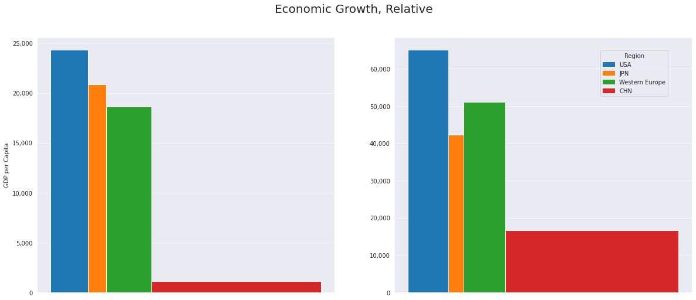
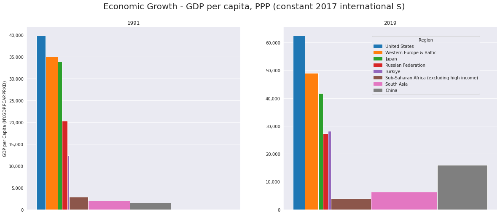
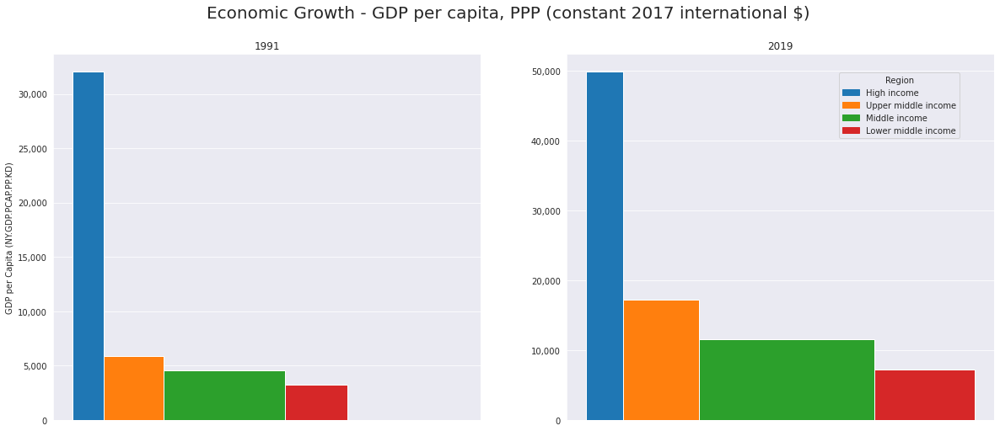
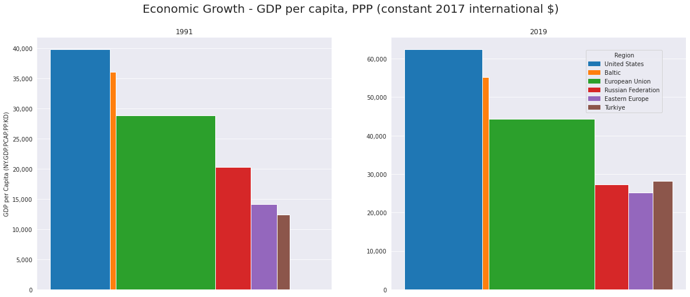
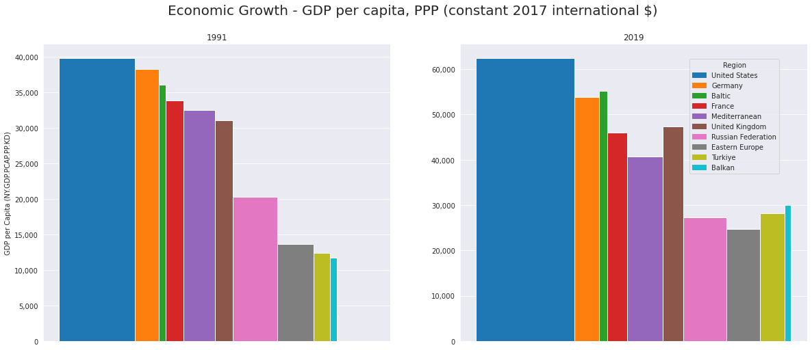

# Did America Really Show Marvellous Economic Performance?

In April 2023, The Economist published an article claiming that
"[America’s economic outperformance is a marvel to behold](https://www.economist.com/briefing/2023/04/13/from-strength-to-strength)".

I loved their visual analysis, but I was surprized by their conclusion. A lot of people believe that America's economic performance is far from being a "marvel".

I repeat and find similar results, but reach a difference conclusion: America has lost its competitiveness, and its performance between 1991-2019 has been only average.
Here is my [Jupyter notebook](Analysis.ipynb), feel free to run and tweak yourself.

## My Analysis

I run the analysis from 1991 (the end of the Soviet Era) and to 2019 (the beginning of COIVD-19). I use constant dollars, rather than current dollar to measure GDP per capita. I also adjust the scale to show economic performance in relation to others.

In this graph, the height of the bars show GDP per capita - a measure of how much wealth is generated every year per individual. The width of the bars show the population, so the total area of the bar shows how much total wealth is generated in the country.

My conclusion is that America kept its place as the wealthy country, but the real growth story came from China. This is a story of convergence.

## Extending the Approach

I thought that the visual was a great way to compare the before and now of economies and populations. So I also included India, Russia and Turkiye.

My conclusion is nuanced: the era beginning in 1991 and ending in 2019 was an era of convergence. However, it was India, China and Turkiye that got the most from this
convergence - among the countries. However, Japan and Russia fell backwards - relatively speaking - and America and Western Europe simply managed to keep their place.

## Are We Really Seeing Convergence?

World Bank data has a classification for high, middle and low income countries. You can see them in the chart below. I interpret this as a story of convergence: A perfectly divergent world would have an "L" shape - a sharp box on the left, and a horizontal box at the bottom. A perfectly convergent
world would have a one rectangle where no country or area is significantly higher than the others. As you can see, the world moved from
a more divergent world to a more convergent world. I conclude that the neo-liberal era was partially successful in its mission.

## Explaining the Russian Aggression

I can also extend the data to show the difference between Russia and the rest of Eastern Europe.

I interpret this graph as follows: Right after the Soviet Era ended, if your average individual in Russia were to move to another country west of it,
say, Poland, and occupy a similar spot on the income, they would perceive a decrease in their welfare, measured by their ability to purchase. However,
as the neo-liberal era drew came close to its conclusion, if the average individual in Russia were to make the same move, they would not perceive a
decrease in their welfare. Comparatively speaking, in 2019, Russia no longer had a better proposition than other European ex-Soviet countries for their
average citizen.

We could even speculate that this trend towards losing its appeal was one of the reasons why Russia decided to invade Ukraine. This line of thought
is in line with the seminal paper by [Fearon (1999) - Rationalist Explanations for War](https://web.stanford.edu/group/fearon-research/cgi-bin/wordpress/wp-content/uploads/2013/10/Rationalist-Explanations-for-War.pdf)

## Within Europe

I also wanted to analyze within Europe, so here it is.

## What's Missing From This Analysis?

This is an analysis done for personal enjoyment in the evenings, so, a lot. One of the gaps is that average GDP does not reflect income inequality.
There is also no method in this analysis to understand the root causes of these changes.

